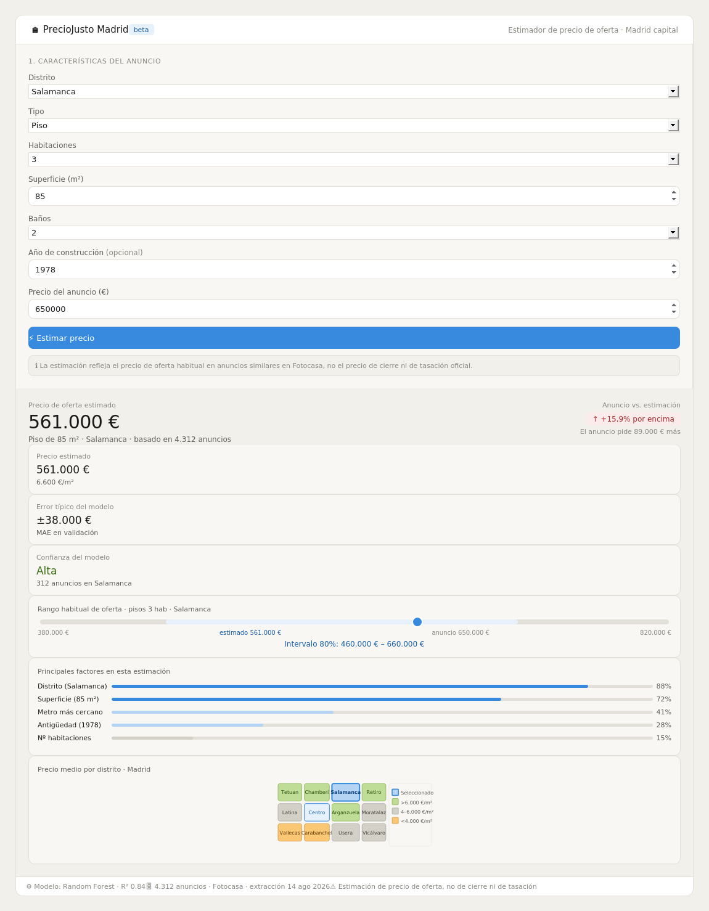

# Entrega 5 - Diseño del frontal y experiencia de usuario del producto

---

## 1. Resumen de la solución y del usuario

**Problema:** cuando un comprador evalúa un anuncio de vivienda en Madrid, no dispone de una referencia objetiva para saber si el precio pedido es razonable para esas características y esa zona. Los portales inmobiliarios muestran precios sin contexto comparativo estructurado.

**Usuario principal:** comprador particular que está evaluando anuncios de pisos en Madrid. Su tarea concreta es decidir si el precio de un anuncio concreto está dentro del rango habitual del mercado o si está sobrevaluado, para poder negociar o descartar el anuncio con más criterio. Un usuario secundario es el vendedor que quiere fijar un precio de publicación competitivo.

**Tipo de producto:** predictor / estimador. El usuario introduce las características de un anuncio y obtiene una estimación del precio de oferta habitual para ese tipo de inmueble en ese distrito, junto con el rango de precios similares y las variables que más pesan en la estimación.

**Resultado principal:** estimación del precio de oferta de referencia en euros, diferencia porcentual respecto al precio del anuncio evaluado, intervalo habitual de precios comparables, y los tres principales factores que explican la estimación.

---

## 2. Imagen mockup del frontal

---

## 3. Justificación del diseño

### 3.1. Utilidad y valor de la solución

El frontal permite al usuario responder una pregunta concreta en menos de un minuto: *¿el precio de este anuncio está dentro del rango habitual o está por encima?* Sin esta herramienta, el usuario tendría que buscar manualmente anuncios similares, compararlos uno a uno y hacer sus propios cálculos — un proceso que puede llevar horas y que suele producir estimaciones poco fiables por sesgo de selección.

El diseño convierte el resultado analítico en una respuesta accionable de tres partes:
1. **El precio estimado en euros**: referencia concreta, no un rango vago.
2. **La diferencia porcentual respecto al anuncio**: el usuario sabe inmediatamente si el anuncio está un 15% por encima del habitual, sin tener que interpretar números.
3. **El intervalo 80%**: muestra que la estimación no es una certeza sino una referencia estadística basada en anuncios comparables.

Se ha decidido **no mostrar** en la pantalla principal: el coeficiente R² del modelo (va en la barra inferior como dato técnico), el número de features usadas, los hiperparámetros del modelo, y el detalle del pipeline de datos. Esta información está disponible en el repositorio del proyecto pero no aporta valor al usuario final y añadiría ruido.

### 3.2. Flujo de usuario

**1. Punto de entrada**
El usuario llega al dashboard con el panel izquierdo vacío y los resultados en estado neutro. Ve claramente que debe rellenar las características del anuncio para obtener una estimación.

**2. Entradas**
El usuario rellena seis campos: distrito (desplegable con los 21 distritos), tipo de inmueble, número de habitaciones, superficie en m², baños y año de construcción (opcional). También puede introducir el precio del anuncio que está evaluando para ver la comparación directa.

**3. Procesamiento**
Al pulsar "Estimar precio", el modelo de regresión (Random Forest entrenado sobre `gold_anuncios`) recibe las variables, aplica las transformaciones del pipeline (encoding de categóricas, imputación de nulos si faltan campos opcionales) y devuelve la predicción. El intervalo se estima a partir de la distribución de residuos del modelo en validación.

**4. Resultado**
El usuario recibe: precio estimado en euros, diferencia porcentual respecto al precio del anuncio introducido (con indicador visual de color: rojo si el anuncio está por encima, verde si está por debajo o en rango), las tres tarjetas de resumen (precio estimado, error típico del modelo, confianza del modelo), el gráfico de rango con la posición del anuncio, y el panel de factores con las variables más relevantes para esa estimación concreta.

**5. Acción**
El usuario puede: modificar algún campo del formulario y volver a estimar (el botón siempre está activo), interpretar si el anuncio merece negociación basándose en la diferencia porcentual, o usar el mapa de distritos para comparar con otras zonas de Madrid.

**6. Excepciones**
- *Campos obligatorios vacíos:* el botón "Estimar precio" permanece activo pero al pulsarlo sin distrito o superficie, aparece un mensaje de error inline junto al campo correspondiente.
- *Distrito con pocos datos:* si el distrito tiene menos de 50 anuncios en el dataset, la tarjeta "Confianza del modelo" muestra "Baja" en naranja y un texto explicativo: "Pocos anuncios disponibles en esta zona; la estimación es menos fiable".
- *Año de construcción ausente:* el modelo imputa la mediana del distrito para ese campo y la estimación se produce igualmente; el panel de factores refleja que la antigüedad no está disponible.

### 3.3. Experiencia de usuario

**Jerarquía visual:** lo primero que capta la atención es el precio estimado en grande (30px, fuera del grid de tarjetas) y la etiqueta de diferencia porcentual con color semántico. El resto de elementos (tarjetas, rango, factores, mapa) están en un nivel visual inferior. El formulario de entrada está en el panel izquierdo, claramente separado de los resultados.

**Simplicidad:** el formulario tiene seis campos, todos familiares para quien está evaluando un anuncio inmobiliario. No hay opciones avanzadas en la pantalla principal. La barra inferior contiene los metadatos técnicos del modelo (R², volumen del dataset, fecha de extracción) para quien quiera consultarlos, sin interrumpir el flujo principal.

**Legibilidad y consistencia:** los precios siempre se muestran en formato "561.000 €" con separador de miles. El color rojo se usa exclusivamente para indicar que el anuncio está por encima del precio estimado; el verde para por debajo o en rango; el azul para los elementos de navegación y énfasis. Los textos evitan terminología técnica: "error típico del modelo" en lugar de "MAE", "confianza del modelo" en lugar de "R²".

**Contexto y confianza:** el rango de precios habitual (intervalo 80%) está visible permanentemente junto al precio estimado. La tarjeta "error típico del modelo" muestra el MAE en euros de forma explícita: el usuario sabe que el modelo "se equivoca de media ±38.000 €", lo que le permite calibrar cuánto confiar en la estimación. El disclaimer en la barra inferior y en el formulario aclara que se trata de precio de oferta, no de precio de cierre ni de tasación.

**Control del usuario:** el formulario siempre es editable; el usuario puede cambiar cualquier campo y volver a estimar sin recargar la página. No hay ningún paso irreversible.

**Feedback del sistema:** el botón "Estimar precio" cambia a estado de carga durante el cálculo. Si se produce un error en el servidor, aparece un mensaje en el área de resultados: "No se ha podido calcular la estimación. Revisa los datos introducidos o inténtalo de nuevo."

---

## 4. Presentación de resultados y explicabilidad

**Resultado principal:** precio de oferta estimado en euros por el modelo de regresión (Random Forest), presentado como un número concreto acompañado del intervalo de confianza al 80%.

**Información adicional para interpretar el resultado:**
- *Diferencia porcentual:* indica si el anuncio evaluado está por encima o por debajo del precio estimado y en cuánto. Es la métrica más directamente útil para el usuario.
- *Intervalo 80%:* muestra el rango dentro del cual cae el 80% de los anuncios comparables en el dataset. Deja claro que la estimación no es una predicción exacta.
- *Error típico del modelo:* MAE en euros del modelo sobre el conjunto de validación. Permite al usuario saber con qué precisión típica trabaja el modelo antes de confiar en la estimación.
- *Confianza del modelo:* indica si hay suficientes anuncios comparables en ese distrito/tipo para que la estimación sea fiable. Se muestra como Alta / Media / Baja con color semántico.
- *Factores principales:* panel con las cinco variables más relevantes para esa estimación concreta y su peso relativo (importancia de features del modelo). Evita que el usuario reciba una cifra sin contexto: sabe por qué el modelo da ese precio.
- *Mapa de calor de distritos:* permite contextualizar el precio estimado dentro del mapa de precios de Madrid, útil para comparar zonas.

**Cómo se evita presentar la estimación como una certeza:**
- El título del resultado dice "Precio de oferta estimado", no "Precio del inmueble" ni "Valor de mercado".
- El intervalo 80% está siempre visible junto al precio.
- La tarjeta "error típico" muestra el MAE en euros.
- El disclaimer en la barra inferior y en el formulario repite que es estimación de oferta, no de cierre ni de tasación.
- El nivel de confianza advierte cuando el modelo tiene pocos datos comparables.

**IA generativa:** no se utiliza IA generativa en este MVP. El panel de factores y las explicaciones son generados directamente a partir de la importancia de features del modelo Random Forest, no de un modelo de lenguaje. Esta decisión es deliberada: las explicaciones del modelo son trazables, reproducibles y no pueden inventar causas. Si en fases posteriores se quisiera añadir un resumen en lenguaje natural, se haría fundamentado exclusivamente en los valores del panel de factores ya calculados, nunca generando texto libre sobre el mercado o el inmueble.

---

## 5. Alcance del MVP

### Qué estará implementado y funcional al final del curso

- Formulario de entrada con los seis campos y validación básica (campos obligatorios, formatos numéricos).
- Llamada al modelo Random Forest entrenado y almacenado localmente.
- Panel de resultados con precio estimado, diferencia porcentual, tarjetas de resumen y panel de factores.
- Rango de precios habitual (intervalo calculado a partir de los residuos del modelo en validación).
- Mapa de calor de distritos con precio medio (mapa estático generado con los datos del dataset gold, no interactivo en el MVP).
- Barra de metadatos del modelo (versión, volumen de datos, fecha de extracción).
- Disclaimer visible de precio de oferta.

### Qué es únicamente representación visual en el mockup

- El mapa de distritos interactivo (en el MVP será una imagen estática generada con matplotlib o folium, no un mapa clickable).
- La barra de navegación lateral (Inicio, Analytics, Conocimiento, Reportes, Configuración) no se implementará en el MVP; la aplicación tendrá una única pantalla.

### Tecnología prevista

- **Backend del modelo:** Python + scikit-learn (Random Forest), exportado con joblib.
- **Frontend:** Streamlit. Permite construir el formulario y el panel de resultados con componentes nativos (selectbox, number_input, metric, progress bar) sin necesidad de desarrollar una aplicación web completa. Es la opción más realista para el alcance del curso.
- **Visualizaciones:** matplotlib / plotly para el gráfico de rango y el panel de factores, embebidos en Streamlit.
- **Mapa:** imagen PNG generada con folium o geopandas como imagen estática, no como componente interactivo.
- **Datos:** el modelo se alimenta del dataset `gold_anuncios` almacenado en SQLite, tal como se definió en la entrega 3.
